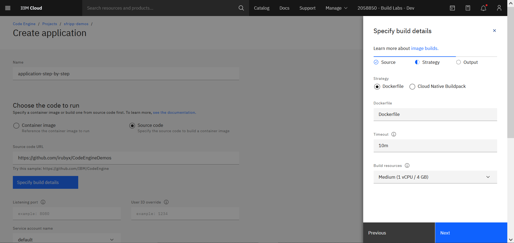
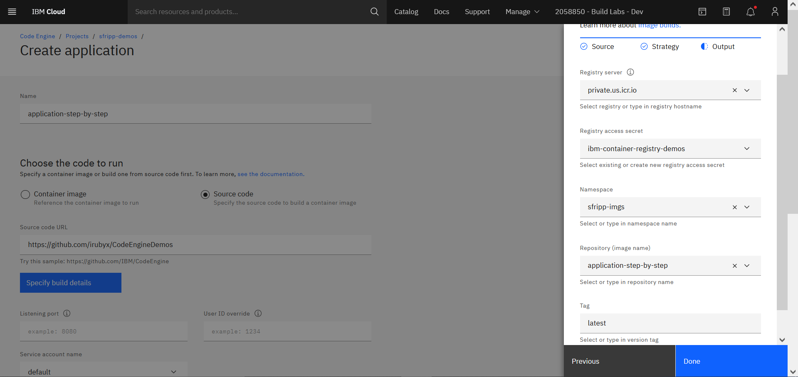

# Code Engine Demos
Repositorio creado con el fin de almacenar el código de las aplicaciones de demo de [IBM Cloud Code Engine](https://cloud.ibm.com/codeengine/overview). Ya que el repositorio es público, cualquiera que quiera experimentar con las aplicaciones es bienvenido.

    Prepared by: Sebastián Fripp
    26/05/2022

## Contenido

- [Code Engine Demos](#code-engine-demos)
  - [Contenido](#contenido)
  - [Demos disponibles](#demos-disponibles)
  - [Despliegue de application en Code Engine](#despliegue-de-application-en-code-engine)
  - [Despliegue de Job en Code Engine](#despliegue-de-job-en-code-engine)

## Demos disponibles
Actualmente las aplicaciones de demo disponibles en el repositorio son las siguientes:

- [print-time](./print-time/)
  - Job que se encarga de imprimir por consola la fecha y hora actual. Se puede vincular a un evento periódico de forma que se creen instancias de forma automática.
- [hello-world](./hello-world/)
  - Aplicación que imprime "Hello ${person}", por default "Hello world", pero cambiando la variable de entorno puede imprimir lo que le indiquemos.
- [weather-app](./weather-app/)
  - Aplicación que dado una ubicación en el mundo, devuelve el clima actual en dicho lugar. A modo de ejemplo de como podríamos obtener un endpoint para visitar nuestra página desde donde deseemos.

Cada una de ellas contiene un archivo *README.md* el cuál contiene instrucciones de como utilizar la app o job y como hacer el despliegue en IBM Cloud Code Engine.

## Despliegue de application en Code Engine
En esta sección se explica paso a paso, como realizar un despliegue de una *application* en Code Engine.

Para comenzar tenemos 2 opciones. La primera es comenzar desde la página principal de Code Engine dando click en la opción de *Start Creating* del apartado **Start with source code**. Y la segunda es comenzar desde el apartado de *Applications* de un proyecto previamente seleccionado, dando click en la opción *Create*. A continuación se muestran los dos caminos:

Si se toma el primer camino, una vez dentro de la interfaz de creación, debemos seleccionar que vamos a crear una *Application* y no un *Job*. De ahora en más, lo que sigue no difiere según el camino que se haya escogido para comenzar.

En primer lugar se nos solicita indicar un nombre para la *Application*. Luego se escoge entre crear la *Application* a partir de una imagen previamente creada, que puede estar almacenada en Dockerhub o en un IBM Container Registry; o la crear una imagen en base a un código fuente almacenado en GitHub. En este caso, se escoge la opción *Source Code* y se proporciona el link al repositorio que almacena el código. Luego de esto, se da click en la opción *Specify build details* para otorgar a Code Engine ciertas indicaciones a la hora de crear la imagen de nuestro código:

Una vez se despliegue el menu lateral para otorgar detalles de la construcción de la imagen, veremos el primero de tres pasos a completar llamado *Source*. Este paso se completa de la siguiente manera:

- **Code Repo URL**
  - Se indica el URL al repositorio de GitHub que contiene el código de la *Application* que se desea desplegar.
- **Code Repo Access**
  - En caso de que el repositorio sea público, se indica *None* como opción. En caso de ser privado, se debe otorgar acceso al mismo mediante una *SSH private key*.
- **Branch Name**
  - En caso de estar trabajando en una rama distinta a *main* se debe indicar en esta opción.
- **Context Directory**
  - En caso de que el código de la *Application* que se desea desplegar, se encuentre en una sub-carpeta dentro del mismo repositorio, se debe indicar en esta opción.

El segundo paso es indicar la estrategia de construcción de la imagen de nuestro código. Este paso se completa de la siguiente manera:

- **Strategy**
  - Se debe seleccionar si se utilizará un archivo Dockerfile o Cloud Native Buildpack. En caso de escoger la primer opción, se solicitará el nombre del archivo.
- **Dockerfile**
  - El nombre del archivo Dockerfile de nuestra *Application*.
- **Timeout**:
  - Se debe indicar el timeout previo a que la construcción de la imagen falle. Por default: 10 minutos.
- **Build Resources**
  - En esta opción se indica a Code Engine la cantidad de recursos que deberá utilizar a la hora de construir nuestra imagen.

El último paso es indicarle a Code Engine, donde almacenar la imagen creada a partir de nuestro código. Este paso se completa de la siguiente manera:

- **Registry server**
  - Se debe indicar donde se almacenará la imagen creada, puede ser tanto en Dockerhub como en IBM Container Registry.
- **Registry access secret**
  - Se debe otorgar acceso, a Dockerhub o al Container Registry, esto se lleva a cabo mediante esta configuración.
- **Namespace**
  - Namespace dentro del contenedor de imágenes seleccionado, donde se almacenará la imagen creada.
- **Repository (image name)**
  - Como bien lo indica el nombre de la opción, es el nombre de la imagen.
- **Tag**
  - La opción de tag es una forma de mantener un versionado entre las imágenes creadas. Por ejemplo: miImagen:1.0, miImagen:2.0, ..., etc.

Una vez especificados todos los detalles acerca de como se desea crear la imagen de nuestro código, opcionalmente podemos indicarle a Code Engine el *Listening port* para las peticiones HTTP (por default: 8080), y el *User ID override* para indicarle una id específica para correr la imagen.\
Luego, se puede seleccionar un *Service account name*, esto es para el manejo de los secretos y el acceso dentro de Kubernetes.\
Y finalmente podemos especificar la visibilidad de la *Application* que estamos creando.

- **Public**
  - La aplicación podrá recibir peticiones desde la red pública de internet y desde el proyecto.
- **Private**
  - La aplicación podrá recibir peticiones desde el proyecto y desde la red privada de internet.
- **Project-Only**
  - La aplicación solo podrá recibir peticiones desde el proyecto.

En el apartado de *Runtime Settings*, existe la posibilidad de editar las siguientes opciones:

- **Number of instances**
  - Se deberá indicar el mínimo y el máximo de instancias deseadas para nuestra aplicación. Por default: mínimo = 0 y máximo = 10.
- **Instance resources**
  - Cuántos recursos queremos dedicar para cada instancia creada de nuestra aplicación. Por default: 1vCPU/4 GB.
- **Requests**
  - Cantidad de peticiones mínimas y máximas por cada instancia de nuestra aplicación. Asi como también el timeout para cada una de las peticiones. Por default: mínimo: 100, máximo: 100 y timeout: 300 segundos.

Llegando al final de la página, se encuentra el apartado *Environmental variables*. Esta sección es opcional, pero en caso de que el código de nuestra aplicación contenga variables de entorno, se deberán  agregar en esta sección.

Por último, se encuentra el apartado *Command override* que al igual que el anterior, es opcional. En este apartado se ha de indicar, en caso de ser necesario, que comandos o argumentos se desean utilizar (reemplazando los que son indicados por defecto) a la hora de crear la imagen. 

Para finalizar todo el proceso, se da click en *Create* para crear la aplicación. Una vez termine el proceso de *Build* de nuestra imagen y el estado de la aplicación sea *Ready*, podemos acceder a la misma mediante el URL provisto por el botón *Test application* ubicado en la parte superior derecha. O de igual manera, accediendo al URL provisto por el apartado de *Endpoints*.

## Despliegue de Job en Code Engine
El proceso para desplegar un *Job* en Code Engine, es igual al de desplegar una *Application*, con la única diferencia que no se solicita ni un *Listening Port* ni un *User ID override*. Además, no se otorga un endpoint por lo que no será necesario indicar la visibilidad del mismo.\
Debido a la similaridad entre los dos procesos de creación, recomiendo seguir los pasos de la sección anterior (**Despliegue de Application en Code Engine**) para crear un *Job*.