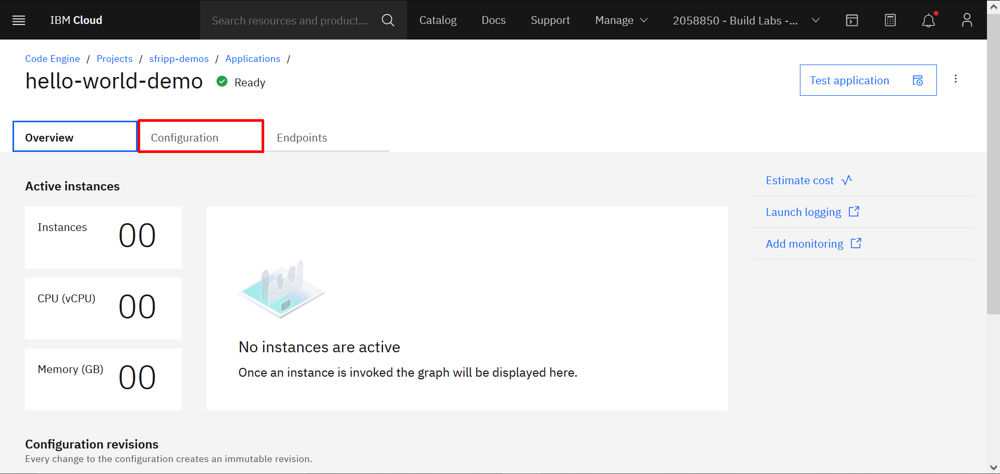
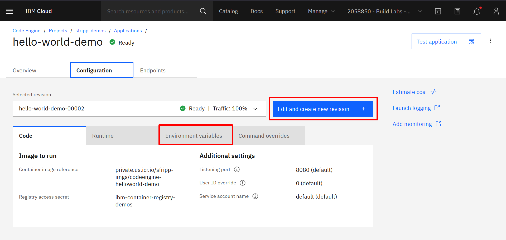
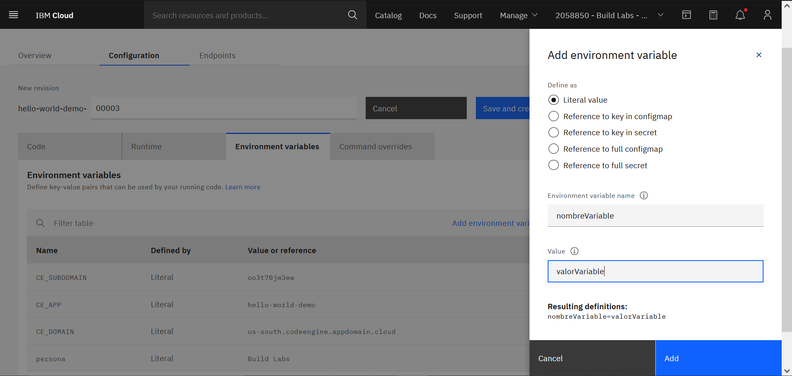
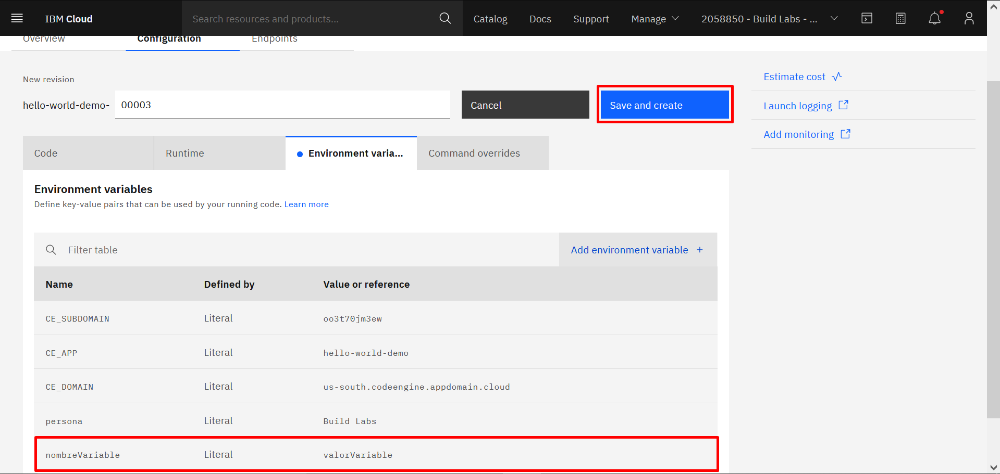
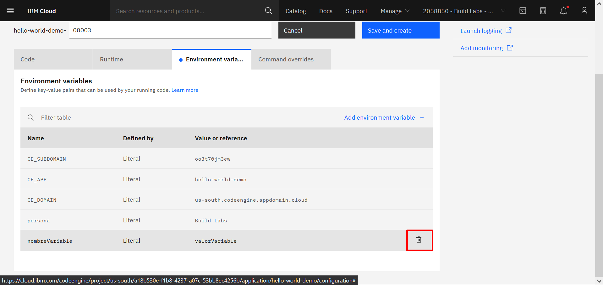

# hello-world
Carpeta contenedora del código necesario para ejecutar la app *hello-world*. La aplicación imprime "Hello ${persona}", por default, *persona* tiene valor de "world" pero al agregar y/o cambiar la variable de entorno se pueden imprimir diferentes mensajes. En la siguiente sección, se explicará como agregar, editar y eliminar variables de entorno.

## Agregar variables de entorno
Code Engine nos plantea la posibilidad de utilizar y modificar variables de entorno en la misma GUI. Para ello, debemos dirigirnos a la pestaña de *"Configuration"* dentro de una aplicación de Code Engine:

Luego debemos seleccionar la opción *"Edit and create new revision"* y finalmente acceder a la sección de *"Environment variables*":

Para agregar una nueva variable de entorno simplemente damos click en la opción *"Add environment variable*" y elegimos que tipo de variable vamos a usar, en este caso utilizaremos *"Literal value"* y completaremos los campos de la siguiente manera:

Por último damos click en *"Add"* y finalmente en *"Save and create"* para crear una nueva versión de nuestra aplicación con la variable de entorno que hayamos agregado.

Una vez la aplicación quede lista para ejecutar, podemos entrar al link que de la misma y verificar si la variable quedó bien configurada.

## Modificar o borrar variables de entorno
Para modificar o borrar una variable de entorno, debemos hacer click nuevamente en *"Edit and create*" para luego entrar en la sección de *"Environment variables"*. Una vez dentro, podemos dar click en el ícono del canasto de basura para borrar la variable de entorno:

