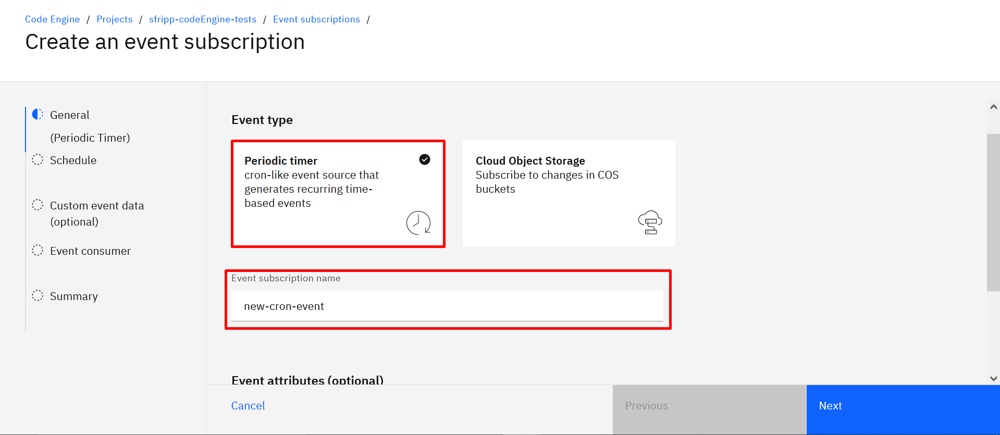
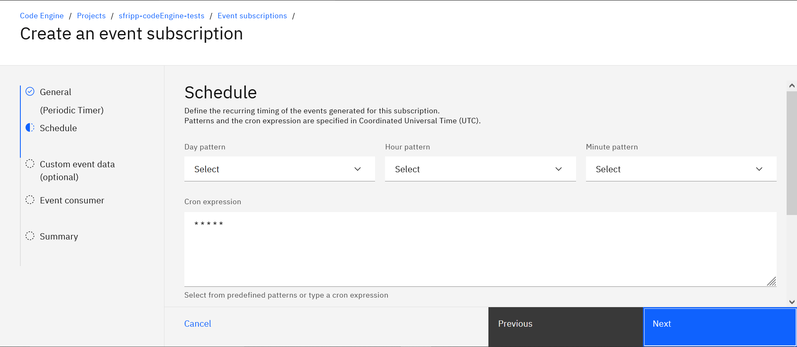

# print-time
Carpeta contenedora del código necesario para ejecutar el job *print-time*. Por default, el job necesita se debe ejecutar manualmente cuando sea necesario, en la siguiente sección se explica como agregar un evento periódico a un job y de esta manera dejarlo automatizado. 

## Como establecer un evento periódico
Para establecer un evento periódico a un job, es necesario dirigirse a [IBM Cloud Code Engine](https://cloud.ibm.com/codeengine/projects) y acceder al proyecto que contiene el job en cuestión.

Una vez dentro del proyecto, se debe crear el evento, por lo que se accede al apartado *"Event subscriptions"* en el menú ubicado en la parte izquierda de la página:

El siguiente paso es hacer click en *"Create"* en la parte superior derecha para poder comenzar con la creación del evento. Para proseguir se selecciona el tipo de evento *"Periódico"* y se escoge un nombre para el evento:

A continuación, se nos requiere indicar la frecuencia con la que se quiere crear una instancia del job, debemos indicarlo en notación cron: * * * * * representando cada asterisco lo siguiente: minutos, horas, días, mes y día de la semana. En este ejemplo se colocan 5 asteriscos lo que se traduce como: una vez por minuto.

    Aclaración: En este ejemplo, se omite la sección *"Custom event data"* ya que se escapa del scop de la demo, para profundizar más en el tema, dirigirse a la documentación oficial de Code Engine.
