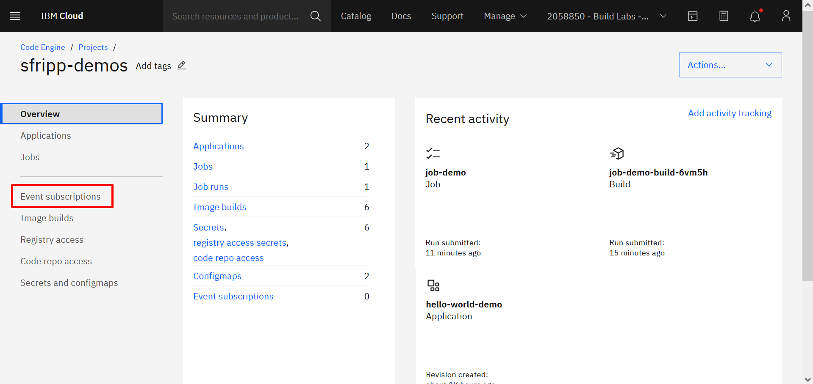
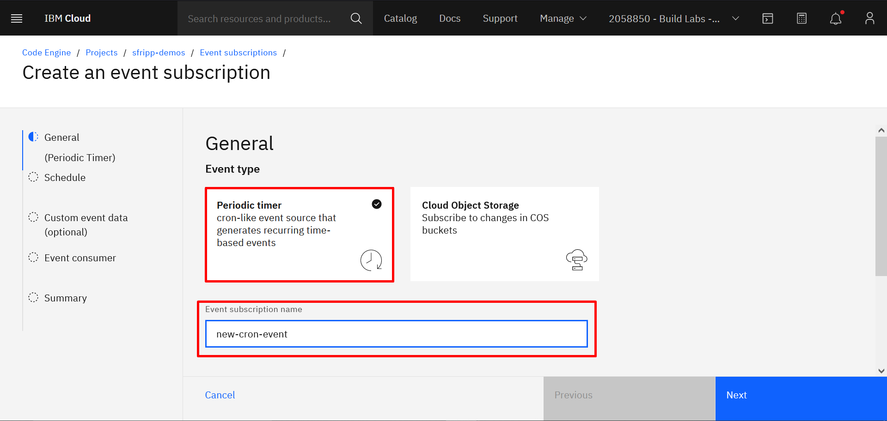
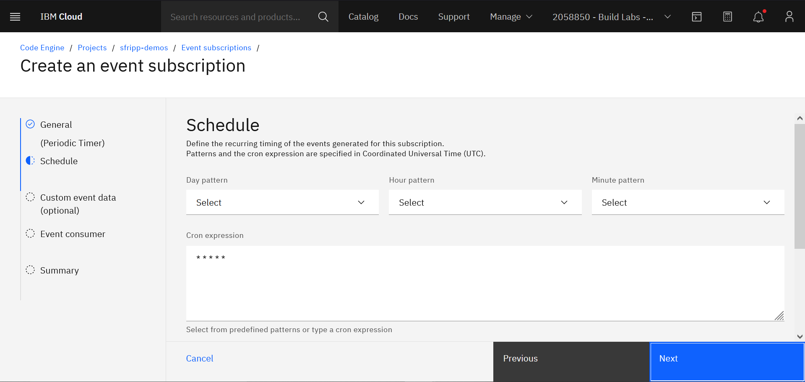
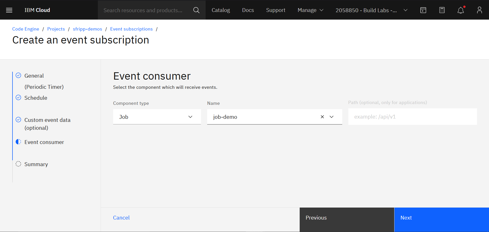
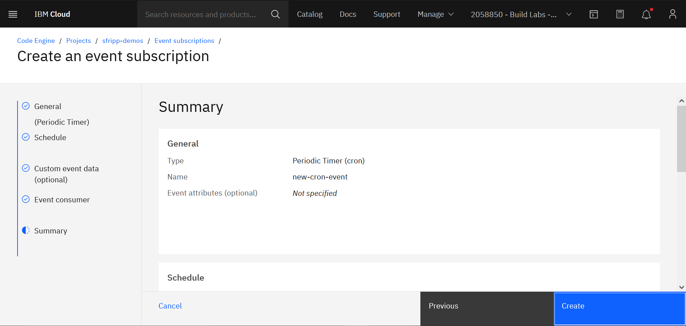

# print-time
Carpeta contenedora del código necesario para ejecutar el job *print-time*. Por default, el job se debe ejecutar manualmente cuando sea necesario, en la siguiente sección se explica como agregar un evento periódico a un job y de esta manera dejarlo automatizado. 

## Creación de un evento periódico
Para crear un evento periódico y vincularlo a un job, es necesario dirigirse a [IBM Cloud Code Engine](https://cloud.ibm.com/codeengine/projects) y acceder al proyecto que contiene el job en cuestión.

Una vez dentro del proyecto, se debe crear el evento, por lo que se accede al apartado *"Event subscriptions"* en el menú ubicado en la parte izquierda de la página:

El siguiente paso es hacer click en *"Create"* en la parte superior derecha para poder comenzar con la creación del evento. Para proseguir se selecciona el tipo de evento *"Periódico"* y se escoge un nombre para el evento:

A continuación, se nos requiere indicar la frecuencia con la que se quiere crear una instancia del job, debemos indicarlo en notación cron: * * * * * representando cada asterisco lo siguiente: minutos, horas, días, mes y día de la semana. En este ejemplo se colocan 5 asteriscos lo que se traduce como: una vez por minuto.

**Aclaración:** En este ejemplo, se omite la sección *"Custom event data"* ya que se escapa del alcance de la demo, para profundizar más en el tema, dirigirse a la documentación oficial de Code Engine.

El último paso previo a finalizar la creación del evento, es escoger qué aplicación o job se desea definir como consumidor del mismo. 

Una vez elegido, se da click en *"Next"* para ver el resumen de las opciones que se han elegido y por último, se da click en *"Create"*:

## Visualización de logs

Para comprobar que efectivamente el job imprimió por consola lo que le habíamos indicado, debemos dirigirnos a la consola y obtener la lista de los jobs que se han ejecutado. Para eso utilizamos el comando:

    $ ibmcloud ce jobrun list

    Listando ejecuciones de trabajo...
    OK

    Nombre                 Solicitado  Pendiente  En ejecución  Fallido  Satisfactorio  Desconocido  Antigüedad
    job-demo-jobrun-9qdv4  0           0          0             0        10             0            105m
    job-demo-jobrun-gkjwd  0           0          0             0        10             0            37m
    job-demo-jobrun-hjnzr  0           0          0             0        1              0            47m
    job-demo-jobrun-pxrdl  0           0          0             0        1              0            86m

Y por último para acceder a los logs de una ejecución especifica de un job, utilizamos el comando:

    $ ibmcloud ce jobrun logs --name job-demo-jobrun-9qdv4

    Obteniendo registros para todas las instancias de la ejecución de trabajo 'job-demo-jobrun-9qdv4'...
    Obteniendo la ejecución de trabajo 'job-demo-jobrun-9qdv4'...
    Obteniendo instancias de la ejecución de trabajo 'job-demo-jobrun-9qdv4'...
    OK

    job-demo-jobrun-9qdv4-0-0/job-demo:
    La hora actual es: 15:16:43

    job-demo-jobrun-9qdv4-1-0/job-demo:
    La hora actual es: 15:16:41

    job-demo-jobrun-9qdv4-2-0/job-demo:
    La hora actual es: 15:16:41

    job-demo-jobrun-9qdv4-3-0/job-demo:
    La hora actual es: 15:16:41

    job-demo-jobrun-9qdv4-4-0/job-demo:
    La hora actual es: 15:16:43

    job-demo-jobrun-9qdv4-5-0/job-demo:
    La hora actual es: 15:16:42

    job-demo-jobrun-9qdv4-6-0/job-demo:
    La hora actual es: 15:16:43

    job-demo-jobrun-9qdv4-7-0/job-demo:
    La hora actual es: 15:16:42

    job-demo-jobrun-9qdv4-8-0/job-demo:
    La hora actual es: 15:16:38

    job-demo-jobrun-9qdv4-9-0/job-demo:
    La hora actual es: 15:16:42