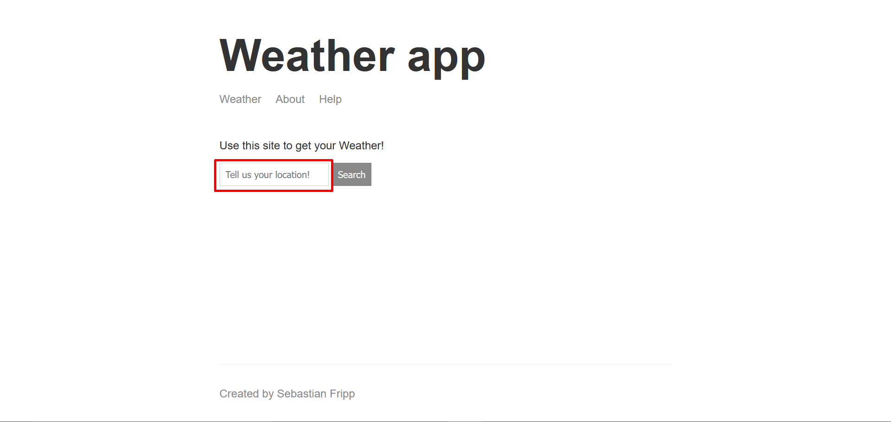
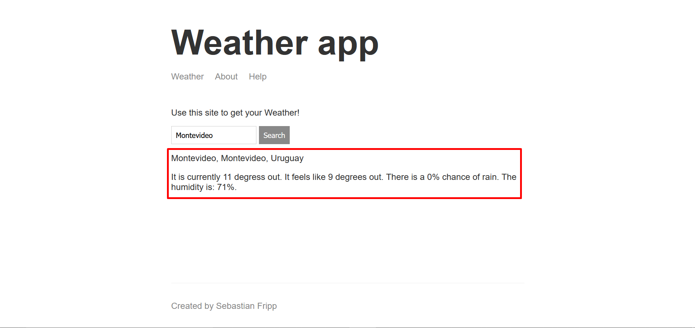

# weather-app
Carpeta contenedora del código necesario para ejecutar la app *weather-app*. La aplicación se encarga de devolver el pronostico del clima de la ubicación que le indiquemos.

## Como utilizar weather-app
La aplicación es muy intuitiva, una vez desplegada debemos acceder al link que nos provee Code Engine. Veremos una interfaz básica que nos solicitará una ubicación:

Simplemente otorgamos la ubicación que deseemos, en este caso *Montevideo* y nos retorna como resultado el clima actual en Montevideo:

